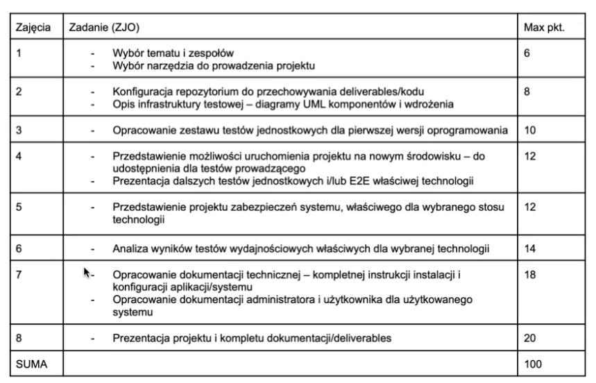

# APZ-CeneoScrapper

## 1. Start kontenera 

- ./APZ-CeneoScrapper/flask_app>
    ```
    - docker-compose up --build -d
    ```
    - lub
    ```
    - docker-compose up --scale app=5 --build -d
    ```
- Testowa strona Flaska jest dostępna pod adresem localhost:80 lub 127.0.0.1:80 wystawiona przy pomocy NGINXa 
    - Usunięcie tabeli i utworzenie: 
        ```
        - docker exec $(docker ps -f name=flask_app-app -q) python manage.py recreate_db
        ```
    - Dodanie admin usera:
        ```
        - docker exec $(docker ps -f name=flask_app-app -q) python manage.py create_admin
        ```
    - Dodanie przykładowych danych:
        ```
        - docker exec $(docker ps -f name=flask_app-app -q) python manage.py towar -q 5000 -r True
        ```


## 2. Endpointy
- http://localhost/ - strona główna;
- http://localhost/login - panel logowania. Dostępny jedynie gdy użytkownik pozostaje niezalogowany;
- http://localhost/register - panel rejestracji. Dostępny jedynie gdy użytkownik pozostaje niezalogowany; 
- http://localhost/confirm/ - potwierdzenie konta po rejestracji;
- http://localhost/products/ - wyświetla listę produktów;
- http://localhost/products/<product_number> - wyświetla konkretny produkt;
- http://localhost/subscriptions/ - wyświetla listę subskrybcji;
- http://localhost/subscriptions/<subscription_number> - wyświetla konkretną subskrybcję;
- http://localhost/subscriptions/<subscription_number>/update - aktualizuje konkretną subskrybcję;


## 2. Wymagania na zaliczenie:



.